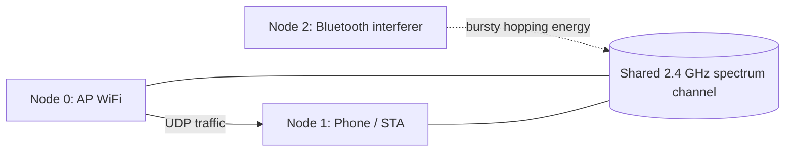

# Sekcja 2. Evaluation Setup: model symulacyjny WiFi + Bluetooth w ns-3

Data: 2026-05-24

Autorzy: do uzupełnienia

## Zakres dokumentu

Ten dokument opisuje wyłącznie część symulacyjną eksperymentu. Celem jest jasne pokazanie, jak zbudowano model w ns-3, jakie parametry są wejściowe, jakie dane wyjściowe są zapisywane oraz w jaki sposób wyniki są później przetwarzane. Część dotycząca stanowiska fizycznego oraz osobnego eksperymentu z zakłócaniem mikrofalówką zostanie opisana w odrębnych sekcjach raportu.

## 2.1 Motywacja i pytanie badawcze

Badamy wpływ pobliskiego urządzenia Bluetooth na wydajność WiFi w paśmie 2.4 GHz. Z perspektywy analizy wydajności systemów pytanie brzmi:

> O ile spada przepustowość WiFi, gdy w tym samym otoczeniu działa burstowy, częstotliwościowo przełączający się interferer Bluetooth zbliżony do realnych słuchawek TWS?

To pytanie jest istotne, ponieważ nowoczesne telefony i słuchawki współdzielą ten sam fragment widma radiowego. Nawet jeśli Bluetooth i WiFi nie nadają „ciągle”, to ich czasowa i częstotliwościowa współbieżność może wywołać zauważalny spadek przepustowości, a czasem także duży rozrzut wyników.

## 2.2 Topologia eksperymentu

Poniżej znajduje się logiczny schemat topologii użytej w symulacji.



Interpretacja:

- węzeł 0 jest punktem dostępowym WiFi,
- węzeł 1 jest telefonem / stacją końcową i jednocześnie miejscem pomiaru,
- węzeł 2 jest interfererem Bluetooth modelowanym jako źródło energii widmowej na tym samym kanale.

## 2.3 Model bazowy i modyfikacje

Punktem wyjścia jest model ns-3 oparty o `SpectrumWifiPhy` oraz `MultiModelSpectrumChannel`. Zamiast prostego modelu pakietowego wykorzystano ścieżkę spektralną, ponieważ tylko wtedy zakłócenie może wprost wpływać na odbiór ramek na poziomie PHY.

Najważniejsze modyfikacje względem prostego scenariusza WiFi są następujące:

1. Bluetooth nie jest pełnym stosem protokołu, tylko interfererem widmowym.
2. Zakłócenie przełącza się między 1 MHz kanałami w paśmie 2.4 GHz.
3. Nadajnik Bluetooth jest uruchamiany w burstach, a nie jako ciągły generator szumu.
4. Scenariusz ma preset `s24-liberty4`, który ma przypominać realne słuchawki TWS w pobliżu telefonu.

To oznacza, że symulacja odwzorowuje przede wszystkim współdzielenie medium radiowego, a nie szczegóły implementacji BLE w firmware słuchawek.

## 2.4 Kluczowe fragmenty kodu

### 2.4.1 Model mocy widmowej Bluetooth

Funkcja `CreateBluetoothHopPsd()` konstruuje wektor PSD dla pojedynczego hopa. Moc wejściowa jest podawana w dBm, a następnie rozdzielana na odpowiednie 1 MHz pasmo w modelu spektralnym.

```cpp
Ptr<SpectrumValue>
CreateBluetoothHopPsd(double centerFrequencyMhz, double txPowerDbm)
{
    Ptr<SpectrumModel> model = SpectrumModelIsm2400MhzRes1Mhz();
    Ptr<SpectrumValue> psd = Create<SpectrumValue>(model);

    const double txPowerW = std::pow(10.0, txPowerDbm / 10.0) / 1000.0;
    const uint32_t bandIndex = static_cast<uint32_t>(std::llround(centerFrequencyMhz - 2400.0));

    if (bandIndex < psd->GetValuesN())
    {
        const auto band = *(psd->ConstBandsBegin() + bandIndex);
        const double bandWidthHz = band.fh - band.fl;
        (*psd)[bandIndex] = txPowerW / bandWidthHz;
    }

    return psd;
}
```

Ten fragment odpowiada za najważniejszy element modelu: zamiast klasycznego „pakietu BT” symulacja wkłada do kanału realną energię radiową.

### 2.4.2 Ustawienie położenia urządzeń

Trzy węzły są ustawione w linii. AP znajduje się w punkcie odniesienia, telefon w odległości `distance`, a Bluetooth w odległości `distance + btDistance`.

```cpp
Ptr<ListPositionAllocator> pos = CreateObject<ListPositionAllocator>();
pos->Add(Vector(0, 0, 0));
pos->Add(Vector(distance, 0, 0));
pos->Add(Vector(distance + btDistance, 0, 0));
```

To upraszcza geometrię i pozwala skupić się na wpływie interferencji, a nie na złożonych efektach ruchu czy wielodrogowości.

### 2.4.3 Burstowy i częstotliwościowo przełączający się nadajnik BT

Poniższy fragment pokazuje, jak węzeł Bluetooth jest uruchamiany na krótkie okresy i jak w każdym okresie zmienia częstotliwość.

```cpp
Ptr<SpectrumValue> btPsd = CreateBluetoothHopPsd(hopFrequencyMhz, btPowerDbm);

WaveformGeneratorHelper waveformGeneratorHelper;
waveformGeneratorHelper.SetChannel(spectrumChannel);
waveformGeneratorHelper.SetTxPowerSpectralDensity(btPsd);
waveformGeneratorHelper.SetPhyAttribute("Period", TimeValue(Seconds(hopDwellSeconds)));
waveformGeneratorHelper.SetPhyAttribute("DutyCycle", DoubleValue(1.0));

NetDeviceContainer btDevices = waveformGeneratorHelper.Install(nodes.Get(2));
Ptr<WaveformGenerator> btWaveform = btDevices.Get(0)
                                        ->GetObject<NonCommunicatingNetDevice>()
                                        ->GetPhy()
                                        ->GetObject<WaveformGenerator>();
Simulator::Schedule(Seconds(hopStart), &WaveformGenerator::Start, btWaveform);
Simulator::Schedule(Seconds(hopStart + hopDwellSeconds), &WaveformGenerator::Stop, btWaveform);
```

Ten mechanizm tworzy powtarzalne bursty, w których interferer przełącza się między kolejnymi kanałami częstotliwości. Dzięki temu model jest bliższy realnemu urządzeniu Bluetooth niż stały sygnał zakłócający.

## 2.5 Parametry wejściowe

W eksperymencie używamy dwóch klas parametrów: stałych i zmiennych.

### Parametry scenariusza

| Parametr | Znaczenie | Typowa wartość w tym eksperymencie |
| --- | --- | ---: |
| `--device-profile` | Preset całego scenariusza | `s24-liberty4` |
| `--wifi-standard` | Standard WiFi | `802.11ax` w presetu |
| `--wifi-channel-width-mhz` | Szerokość kanału WiFi | `40` |
| `--data-rate` | Wymagany bitrate ruchu aplikacyjnego | `250Mbps` |
| `--distance` | Odległość AP-telefon | `10 m` |
| `--simulation-time` | Długość symulacji | `10s` |
| `--bluetooth-enabled` | Włączenie interferera BT | `true/false` |
| `--rng-run` | Numer powtórzenia / seed | np. `1..20` lub `145..155` |

### Parametry modelu Bluetooth

| Parametr | Znaczenie | Wartość w `s24-liberty4` |
| --- | --- | ---: |
| `--bt-burst-on-ms` | Długość aktywności BT w burst | `2.5 ms` |
| `--bt-burst-period-ms` | Okres powtarzania burstów | `7.5 ms` |
| `--bt-distance` | Odległość BT od telefonu | `0.02 m` |
| `--bt-power-dbm` | Moc nadajnika BT | `-3 dBm` |
| `--bt-hop-dwell-us` | Czas przebywania na jednym hopie | `625 us` |
| `--bt-hop-count` | Liczba kanałów w sekwencji częstotliwościowej | `79` |

### Co oznacza preset `s24-liberty4`

Preset ustawia WiFi na 802.11ax z kanałem 40 MHz i podnosi oferowany ruch aplikacyjny do 250 Mbps. Po stronie Bluetooth ustawia burstowy, niskomocowy interferer z małym offsetem od telefonu, aby przybliżyć scenariusz realnych słuchawek TWS znajdujących się blisko urządzenia mobilnego.

## 2.6 Dane wyjściowe i ich format

Symulacja zapisuje wyniki do CSV. Każdy wiersz odpowiada jednemu przebiegowi z konkretnym seed-em i stanem BT.

```csv
rng_run,bluetooth_enabled,distance_m,simulation_time_s,rx_packets,rx_bytes,throughput_mbps
```

Znaczenie kolumn:

- `rng_run` - numer powtórzenia / seed losowości,
- `bluetooth_enabled` - 0 dla BT off, 1 dla BT on,
- `distance_m` - odległość AP-telefon,
- `simulation_time_s` - czas trwania symulacji,
- `rx_packets` - liczba odebranych pakietów,
- `rx_bytes` - suma odebranych bajtów,
- `throughput_mbps` - przepustowość obliczona z odebranych bajtów.

Oprócz CSV pipeline generuje wykresy w dwóch formatach: PNG i SVG. Do raportu należy używać wersji SVG, ponieważ spełnia ona wymaganie grafiki wektorowej.

## 2.7 Przetwarzanie wyników

Wyniki są przetwarzane skryptem `scripts/plot_results.py`.

Główne kroki analizy są następujące:

1. Wczytanie CSV do `pandas`.
2. Podział danych na `bluetooth_enabled = 0` i `bluetooth_enabled = 1`.
3. Wyliczenie średniej, odchylenia standardowego i mediany.
4. Zestawienie danych parowanych po `rng_run`, aby porównać BT off i BT on dla tego samego seeda.
5. Zapis wykresów do PNG i SVG.

W analizie sekcji Results dodatkowo używamy 95% przedziału ufności dla średniej, liczony w przybliżeniu jako:

$$
CI_{95\%} \approx 1.96 \cdot \frac{\sigma}{\sqrt{n}}
$$

To proste przybliżenie jest wystarczające do opisu tendencji w tym projekcie, ale jeśli później będzie potrzeba mocniejszego oszacowania niepewności, można je zastąpić bootstrapem.

## 2.8 Pliki wynikowe

Po przetworzeniu CSV otrzymujemy zestawy figur zapisane w osobnych katalogach:

- `results/bluetooth/`

W każdym katalogu są trzy główne wykresy:

- `throughput_comparison.svg`
- `throughput_distribution.svg`
- `throughput_paired_runs.svg`
- `throughput_convergence.svg`

Pierwszy z wykresów porównuje średnie BT off i BT on. Drugi pokazuje rozkłady w osobnych panelach z lokalnym zoomem, aby przedziały ufności i mediany były czytelne. Trzeci przedstawia porównanie run-by-run, a czwarty czteropanelowy wykres pokazuje osobno zbieżność BT off, zbieżność BT on, skumulowaną stratę throughputu oraz skumulowaną redukcję procentową.

## 2.9 Jak uruchamiany jest batch sweep

Batch uruchamia symulację osobno dla BT off i BT on, a następnie zapisuje oba wyniki do tego samego CSV.

Przykład dla głównej serii:

```bash
bash scripts/run_bluetooth_sweep.sh 21 results/bluetooth/s24-liberty4-sweep-145-165.csv s24-liberty4 145
```

Przykład dla serii kontrolnej:

```bash
bash scripts/run_bluetooth_sweep.sh 21 results/bluetooth/s24-liberty4-sweep-145-165.csv s24-liberty4 145
```

To podejście daje bezpośrednio porównywalne pary wyników i ułatwia ocenę nie tylko średniej, ale też rozrzutu oraz punktów odstających.

## 2.10 Gdzie miejsce na kolejne eksperymenty

W finalnym raporcie warto zachować osobne sekcje na:

- stanowisko fizyczne z telefonem i słuchawkami,
- eksperyment z zakłócaniem mikrofalówką.

W tym dokumencie ich nie rozwijamy, żeby nie mieszać warstwy symulacyjnej z późniejszymi testami IRL.